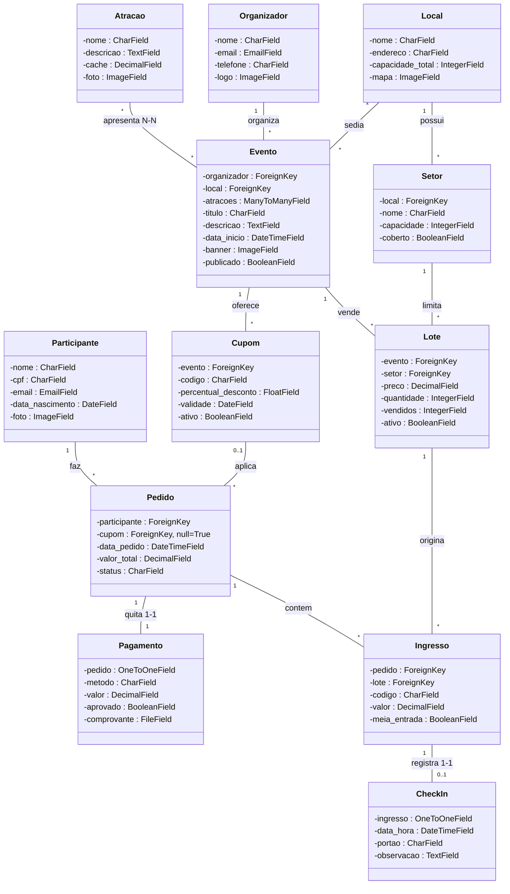

# Diagrama de Classes

```mermaid
classDiagram
direction TB
class Atracao {
  -nome : CharField
  -descricao : TextField
  -cache : DecimalField
  -foto : ImageField
}
class Organizador {
  -nome : CharField
  -email : EmailField
  -telefone : CharField
  -logo : ImageField
}
class Local {
  -nome : CharField
  -endereco : CharField
  -capacidade_total : IntegerField
  -mapa : ImageField
}
class Evento {
  -organizador : ForeignKey
  -local : ForeignKey
  -atracoes : ManyToManyField
  -titulo : CharField
  -descricao : TextField
  -data_inicio : DateTimeField
  -banner : ImageField
  -publicado : BooleanField
}
class Setor {
  -local : ForeignKey
  -nome : CharField
  -capacidade : IntegerField
  -coberto : BooleanField
}
class Cupom {
  -evento : ForeignKey
  -codigo : CharField
  -percentual_desconto : FloatField
  -validade : DateField
  -ativo : BooleanField
}
class Lote {
  -evento : ForeignKey
  -setor : ForeignKey
  -preco : DecimalField
  -quantidade : IntegerField
  -vendidos : IntegerField
  -ativo : BooleanField
}
class Participante {
  -nome : CharField
  -cpf : CharField
  -email : EmailField
  -data_nascimento : DateField
  -foto : ImageField
}
class Pedido {
  -participante : ForeignKey
  -cupom : ForeignKey, null=True
  -data_pedido : DateTimeField
  -valor_total : DecimalField
  -status : CharField
}
class Pagamento {
  -pedido : OneToOneField
  -metodo : CharField
  -valor : DecimalField
  -aprovado : BooleanField
  -comprovante : FileField
}
class Ingresso {
  -pedido : ForeignKey
  -lote : ForeignKey
  -codigo : CharField
  -valor : DecimalField
  -meia_entrada : BooleanField
}
class CheckIn {
  -ingresso : OneToOneField
  -data_hora : DateTimeField
  -portao : CharField
  -observacao : TextField
}
Atracao "*" -- "*" Evento : apresenta N-N
Organizador "1" -- "*" Evento : organiza
Local "1" -- "*" Evento : sedia
Local "1" -- "*" Setor : possui
Evento "1" -- "*" Cupom : oferece
Evento "1" -- "*" Lote : vende
Setor "1" -- "*" Lote : limita
Participante "1" -- "*" Pedido : faz
Cupom "0..1" -- "*" Pedido : aplica
Pedido "1" -- "1" Pagamento : quita 1-1
Pedido "1" -- "*" Ingresso : contem
Lote "1" -- "*" Ingresso : origina
Ingresso "1" -- "0..1" CheckIn : registra 1-1
```